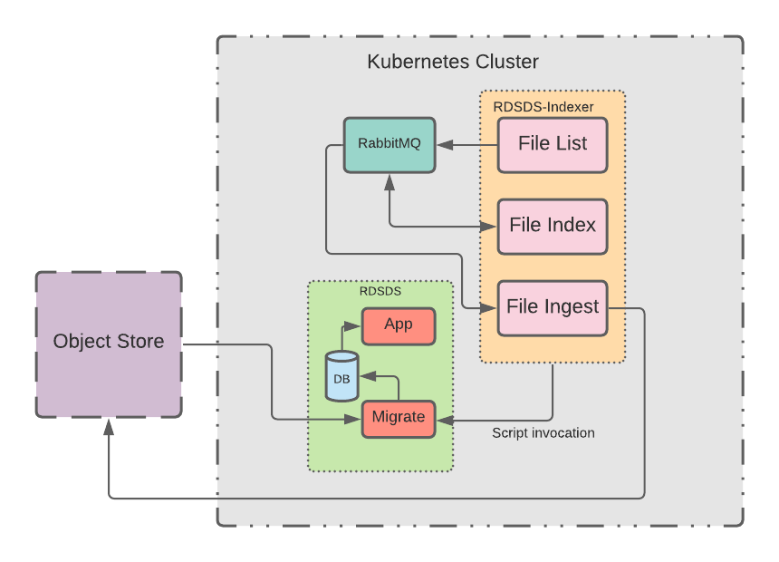

# Reference DataSet Distribution Service Indexer (RDSDS-Indexer)

This repository hosts indexing for GA4GH complaint DRS service [RDSDS](https://github.com/EMBL-EBI-TSI/RDSDS-Server). This project attempts to index datasets internal to EMBL-EBI based on OmicsDI dataset entries, but can be reused to support other databases also. 

## Indexing on Kubernetes

  The earlier implementation of RDSDS indexing was written to be executed in LSF cluster. As the intention is to make it usable to larger users, it is now made Kubernetes-native to be run as Kubernetes Job. The flow diagram is as below,

  

### Pre-requisites:
1. RabbitMQ Server (^1.30.0) 
2. s3 compatible Object storage (e.g. Minio ^3.7.15)
3. Kubernetes ^1.15 

### Job Details:
The indexing job is separated into three parts which are loosely coupled by the rabbitMQ server (will be mentioned as 'MQ' henceforth).  

1. **File Listing**: The first job expects an CSV file (as an accessible URL) listing all the datasets to be indexed. The CSV is then pushed to MQ for further processing. The `dataset_url` should be accessible ftp URL with wildcard for directory. The structure is as follows,

|dataset|id|dataset_url|
|--|--|--|
| eva|PRJEB32692|ftp://ftp.ebi.ac.uk/pub/databases/eva/PRJEB32692/*|

2. **File Indexing**: This job will take each dataset from the queue , index it, and put the indexed value in separate queues for objects/checksums/access_methods/contents in MQ.

3.  **File Ingestion**: This job will consolidate each of the queues and make a CSV file for each queue such as objects.csv, contents.csv, checksums.csv and access_methods.csv. The files are then uploaded to object storage.

After the files are uploaded, the application is fed with the csv files through gitlab pipeline trigger as mentioned below,

    curl -X POST \
         -F token=<CICD trigger token> \
         -F ref=<branch> \
    	 -F variables[DB_MIGRATE]='sh scripts/migrate-csv-data.sh' \
    	 -F variables[K8S_SECRET_S3_HOST]=<s3 host> \
    	 -F variables[K8S_SECRET_S3_PATH]='s3://relative/path/' \
    	 -F variables[K8S_SECRET_http_proxy]=<proxy> \
    	 -F variables[K8S_SECRET_https_proxy]=<proxy> \
    	 -F variables[K8S_SECRET_HTTP_PROXY]=<proxy> \
    	 -F variables[K8S_SECRET_HTTPS_PROXY]=<proxy> \
    	 -F variables[K8S_SECRET_NO_PROXY]='localhost,.cluster.local,.minio' \
    	 -F variables[K8S_SECRET_no_proxy]='localhost,.cluster.local,.minio' \
         https://<gitlab url>/api/v4/projects/<project id>/trigger/pipeline

All of the above steps are put into a script in `k8s-job/job/dsds-indexing.sh`. The environment variables needed are,

 - KUBE_NAMESPACE: Namespace where jobs would run, need not be same as application.
 - TRIGGER_TOKEN: Token to trigger applciation pipeline
 - S3_HOST: object storage host (https://s3-host)
 - S3_PATH: object storage path (s3://rdsds-indexing/indexed_items/)
 - AWS_ACCESS_KEY: AWS access key
 - AWS_SECRET_KEY: AWS secret key
 - TRIGGER_URL: Trigger URL acquired from gitlab

The Jobs are configured by ConfigMap present in `k8s-job/job/indexer-configmap.yml` which also needs to be configured.

- BROKER_URL: MQ URL 
- QUEUE: Queue where files would be listed for processing
- CSV_INPUT: CSV Input URL for indexer
- AWS_ACCESS_KEY/AWS_SECRET_KEY: object storage credentials with which output file would be uploaded
- S3_ENDPOINT: object store URL where output file would be uploaded
- S3_OUTPUT_BUCKET: Output file bucket
- S3_OUTPUT_FILEPATH: Output file relative path
- HTTP_PROXY/HTTPS_PROXY: Proxy to access public URL or to install package

## Indexing Locally

The process is mentioned below taking expression-atlas as an example. This will repeat for each of dataset groups,

1. First, the datasets are pulled from omicsDI by dataset where arrayexpress is an example'',

    `python  scripts/extract-omicsdi-datasets.py  arrayexpress`
2. The above script generates CSV which contains dataset file list along with its storage path in EBI internal storage like below,
	
	`/ebi/ftp/pub/databases/arrayexpress/data/experiment/MEXP/E-MEXP-3732`
3. These CSV files are then fed into batch processing on LSF cluster where files are already mounted. The script which does the indexing process is,

    `./1-process-bundle-local.sh eva.csv`
4. The batch process generates list of files along with its checksums (crc32c,md5,blake2b etc.) and locations in EBI (ftp,sftp,globus etc.). These files are further processed so that it is structured like RDSDS data structure so that it can be fed easily into the application. In the end it generates files like,
	- objects.csv
	- access_methods.csv
	- checksums.csv
	- contents.csv
 

This work is co-funded by the EOSC-hub project (Horizon 2020) under Grant number 777536.